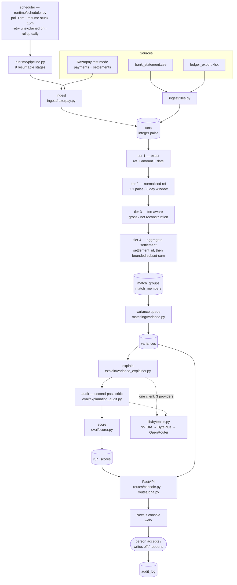

# AI Finance Controller — multi-source payment reconciliation

Reconciles three records of the same money: Razorpay test-mode payments and
settlements pulled from the API, a bank statement CSV, and an internal ledger
XLSX. It produces match groups linking rows that describe one economic event, a
variance queue holding everything that did not reconcile, and for each variance
an LLM-written category, explanation and suggested action. A person works that
queue in the console and accepts, writes off, or reopens each row; every
decision writes an `audit_log` entry recording what the row looked like
beforehand.

## Where the numbers come from

Batch `9adfb642-e4e3-4227-aff0-c035be3ecb08`, scored `2026-09-01T16:45:24Z`.
The figures below are the `run_scores` row for that batch and can be read back
with `python -m scripts.run_pipeline 9adfb642-e4e3-4227-aff0-c035be3ecb08`.

This batch is a **generated corpus**, not live merchant data. Precision and
recall only exist because the generator recorded which rows belong to the same
economic event; no real dataset carries that, and the matchers are firewalled
from reading it (see below). Razorpay test-mode ingestion and the CSV/XLSX file
parsers are real code paths that run, but the numbers here are from the corpus,
because it is the only source that has an answer key to score against.

| | |
|---|---|
| Records processed | 1,198 |
| Match rate | 86.39% (1,035 of 1,198 rows placed in a group) |
| Precision | 1.000000 |
| Recall | 0.998858 |
| F1 | 0.999429 |
| True / false positives | 1,749 / 0 |
| False negatives | 2 |
| Explanation grounding rate | 93.33% |
| Unexplained value left open | ₹2,580.43 (258,043 paise) |

The match rate has a ceiling below 100% by construction. 162 of the 1,198 rows
are noise the corpus injects deliberately — rows belonging to no economic event,
which a correct matcher must leave unmatched. That puts the ceiling at 1,036 of
1,198, or 86.48%; the run reached 86.39%, so it placed 1,035 of the 1,036 rows
that had a counterpart. Precision is pair-level, not group-level (see
[Measuring accuracy](#measuring-accuracy-without-letting-the-matchers-see-it)),
and zero false positives across 1,749 predicted pairs means no two rows from
different economic events were merged.

The run produced 311 match groups and 169 variances, of which 135 were explained
and 34 remain open for a person. `wall_clock_seconds` on this row reads ~20
hours and is not a performance figure: it measures first to last `audit_log`
timestamp, and this batch was interrupted overnight and resumed the next day.

## Architecture



The nine stages are `ingest, tier1, tier2, tier3, tier4, variance, explain,
audit, score`, in that order, defined in `STAGES` in
[`api/runtime/pipeline.py`](api/runtime/pipeline.py). Each stage bookends itself
with an `audit_log` row and those rows are the resumption state — there is no
separate progress table. A batch that dies at the explain stage re-runs only
what did not record a `stage_exit`, which matters because the explain and audit
stages cost money in LLM calls.

## Why the model sits downstream of matching, and never inside it

Matching is arithmetic over integer paise, and arithmetic is checkable. A tier-3
match asserts that a gateway gross of 12,000 minus a fee of 240 minus tax of 43
equals the bank's net of 11,717; that claim is either true or it is not, it is
true identically on every run, and when it is wrong you can point at the number
that made it wrong. Handing that to a model would trade a property you can
verify for one you can only sample: the same batch could match differently on
Tuesday, a merged pair would carry no derivation you could audit, and the
failure mode is silent — two unrelated payments confidently joined, with a
fluent sentence explaining why. Reconciliation output is used to move money and
answer auditors, so a matcher that is right 97% of the time in an unpredictable
3% is worse than one that is right less often but tells you exactly which rows
it could not resolve. So the four tiers are deterministic, and everything they
cannot resolve goes to the variance queue rather than being guessed at. The
model then works only on that residue, where the deterministic answer has
already been established to not exist, and where its output is a *description*
routed to a person — never a write to a match group. This is also why the
firewall below is enforced at runtime rather than trusted: the whole argument
collapses if the matchers can see the answer key.

## Measuring accuracy without letting the matchers see it

The synthetic corpus stamps every row it generates with a `truth_group` — rows
projected from the same underlying economic event share one — and marks injected
noise rows `is_noise = true`. Those two columns are the answer key.

The firewall is a runtime assertion, not a convention. Every matcher declares
the only column list it will ever select and checks it against
`FORBIDDEN_COLUMNS = {"truth_group", "is_noise"}` at import, then re-checks the
columns actually returned by the database on every fetch —
`_assert_no_truth_columns` in each of
[`tier1_exact.py`](api/matching/tier1_exact.py),
[`tier2_normalised.py`](api/matching/tier2_normalised.py),
[`tier3_fee_aware.py`](api/matching/tier3_fee_aware.py),
[`tier4_aggregate.py`](api/matching/tier4_aggregate.py) and
[`variance.py`](api/matching/variance.py), and `_assert_no_forbidden` in
[`variance_explainer.py`](api/explain/variance_explainer.py). If a forbidden
column ever appears the run fails loudly rather than producing a number nobody
can trust. [`eval/scorer.py`](api/eval/scorer.py) is the deliberate inverse: it
is the one module that reads `GROUND_TRUTH_COLUMNS`, and it never writes back to
`txns` or `match_groups`.

Scoring is over **pairs**, not groups. A true positive is two rows that share a
`truth_group` placed in the same match group; a false positive is two rows in
one match group that do not share a `truth_group` (or where either is noise); a
false negative is a true pair left split. Group-level scoring would give a
17-member settlement the same weight as a 2-row pair and would score a group
that got 16 of 17 members right as a total failure — pair-level scoring gives
partial credit correctly, which matters most on the many-to-one settlements.

The explanation path is graded separately, because there is no `truth_group` for
"why does this variance exist": a second-pass critic re-reads the original record
alongside the explanation written about it and judges whether the reasoning
follows, whether the cited amounts are really present, and whether the suggested
action fits the category. Anything failing any check is reset to open. That pass
rate is `explanation_grounding_pct`.

A ground-truth leak in that explanation path — the corpus label reaching the
model through ordinary `description` and `raw` record fields — was found, fixed
at context-build time, guarded, and measured. Full methodology, the before/after
numbers, and what the leak was actually worth are in
[EVALUATION.md](EVALUATION.md).

## Setup

Needs Python 3.13 and a Supabase project. Node is needed only for the console
(steps 7–8; the build here was verified on Node 24.11.1 and `web/package.json`
declares no minimum). Razorpay credentials are needed only to ingest live
test-mode activity — the corpus path below does not call Razorpay, so steps 1–6
reach a scored run without them.

1. **Clone and configure the API environment.**
   ```bash
   git clone https://github.com/ojasshelke46/AI-Finance-Controller-Razorpay.git
   cd AI-Finance-Controller-Razorpay
   cp .env.example .env
   ```
   Fill in `.env`: `SUPABASE_URL` and `SUPABASE_SERVICE_KEY` from the Supabase
   project's API settings, and **at least one** LLM key — `NVIDIA_API_KEY`,
   `BYTEPLUS_ARK_API_KEY`, or `OPENROUTER_API_KEY`. The provider chain tries
   them in that order and falls through to the next when one is unset or
   failing, so one working key is enough to complete a run. The base URL and
   model for each provider are already filled in. `RAZORPAY_KEY_ID` and
   `RAZORPAY_KEY_SECRET` (test mode) are only needed for live ingestion and can
   be left blank for steps 2–6; without them `/health` will report Razorpay
   down, which is accurate rather than broken.

2. **Apply the migrations, in order.** There is no migration runner; paste each
   file into the Supabase SQL editor and run it:
   ```
   api/migrations/0001_init.sql
   api/migrations/0002_recon_engine.sql
   api/migrations/0003_txns_external_ref_unique.sql
   api/migrations/0004_drop_txns_external_ref_unique.sql
   api/migrations/0005_match_groups_variance_components.sql
   api/migrations/0006_run_scores_explanation_grounding.sql
   ```
   0003 and 0004 must both be applied and in that order — 0004 drops an index
   0003 creates, and the pair is kept rather than collapsed so the schema history
   stays honest.

3. **Install the Python dependencies.**
   ```bash
   cd api
   python3 -m venv .venv
   source .venv/bin/activate
   pip install -r requirements.txt
   ```

4. **Generate a corpus.** This writes ~1,200 `txns` rows with a known answer key
   and prints the new batch id:
   ```bash
   python -m scripts.generate_corpus
   ```
   The seed is fixed (`CORPUS_SEED`, default `20260826`), so this is
   reproducible. `CORPUS_EVENTS` (default `506`) sets the size.

5. **Run the pipeline over that batch.** Substitute the batch id printed by
   step 4:
   ```bash
   python -m scripts.run_pipeline <batch_id>
   ```
   This runs all nine stages and prints the `run_scores` row. It ends with
   `GATE PASSED` when the batch reached `complete` and a scored row exists. The
   explain and audit stages make real LLM calls, so this takes a few minutes.

6. **Check the answer key never reached a model:**
   ```bash
   python -m scripts.leak_check <batch_id>
   ```

7. **Start the API** (from `api/`, with the venv active):
   ```bash
   uvicorn main:app --reload --port 8000
   ```
   `http://127.0.0.1:8000/health` reports Supabase, Razorpay and LLM
   reachability. Starting the API also starts the scheduler; set
   `SCHEDULER_ENABLED=0` to run the API without it.

8. **Start the console** (in a second terminal, from the repository root):
   ```bash
   cd web
   cp .env.example .env.local     # fill in the two NEXT_PUBLIC_SUPABASE_* values
   npm install
   npm run dev
   ```
   The console is at `http://localhost:3000`. Next.js reads `web/.env.local`,
   not the root `.env`; use the Supabase **anon** key there, never the service
   key, because `NEXT_PUBLIC_` variables are compiled into the browser bundle.

Other entry points: `python -m scripts.run_scorer <batch_id>` scores a batch on
its own, `python -m scripts.run_explainer_accuracy <batch_id> [batch_id]` grades
explainer categories and prints a before/after when given two batches,
`python -m scripts.chaos_test` runs the failure scenarios, and
`python -m scripts.run_qna_demo <batch_id>` exercises the grounded Q&A endpoint.
`scripts/seed_razorpay.py` additionally needs `playwright` (`pip install
playwright && playwright install chromium`), which is not in `requirements.txt`
because nothing in the pipeline path uses it.

## Known limitations

- **The corpus composition skews what category accuracy can tell you.** In the
  headline batch, 162 of the 169 graded variances are the same scenario type
  (injected noise rows). The explainer's category accuracy is therefore
  dominated by one case whose acceptable answers are deliberately broad
  (`missing_source_record` or `unexplained` both count), so the headline
  accuracy number is close to a measurement of that single scenario rather than
  of the classifier across the taxonomy. The scenarios that would discriminate
  hardest — fee splits, timing drift, duplicates — mostly get resolved by the
  deterministic tiers and never reach the variance queue at all.
- **The leak before/after was one seed, one provider, one run per condition.**
  Both runs were pinned to a single LLM provider so the redaction was the only
  variable, and neither condition was repeated, so there is no variance estimate
  and no claim that the deltas would survive re-running. See EVALUATION.md.
- **The evaluation harness depends on synthetic ground truth.** Precision,
  recall and F1 all derive from `truth_group`, which exists because the corpus
  generator wrote it. Real merchant data has no answer key, so on real data
  these numbers cannot be computed at all — the matchers would still run, but
  the only available signals would be the ones that need no ground truth: how
  much value ended up unexplained, and whether the reconciliation arithmetic
  closes.
- **Razorpay ingestion is test mode only,** against a seeded test account. It
  has not been run against a production merchant account or at production
  volume; the largest batch here is ~1,200 rows.
- **The batch lock is advisory,** a compare-and-set on a timestamp in
  `run_state`, sufficient for the single scheduler process this runs as. It is
  not a distributed lock.
- **Q&A refuses rather than answers when it cannot trace a figure.** Every
  number in a generated answer is checked against the numbers in the supplied
  context; one regeneration is attempted, then the answer is withheld. That is
  the intended behaviour, but it means some legitimate questions get a refusal.
- **Older batches in the database are in mixed states.** Some early ones predate
  `run_scores` and carry no score; several are chaos-test artifacts left
  deliberately in `pending` or carrying an `error_text` from an injected fault.
  Only the batch named above should be read as a result.

## Resilience

Six scripted failure scenarios, in [`api/scripts/chaos_test.py`](api/scripts/chaos_test.py),
run against the live system (`python -m scripts.chaos_test`, or a scenario
number to run one). Each asserts the specific expected behaviour, that the
service is still alive afterwards, and that the batch ended in a state you could
defend to an auditor:

1. every LLM provider broken — the batch still reaches scoring, variances stay open rather than being invented
2. Supabase connection drops mid-run — transient drops retry, a sustained outage fails the batch cleanly with a traceback, and the resume skips completed stages
3. Razorpay returns 429 — backs off and retries; a 401 fails fast instead of retrying
4. corrupt rows mid-CSV — the parser skips them with line numbers and keeps the good rows
5. the same range ingested twice — no duplicate rows
6. NVIDIA and BytePlus both degraded — OpenRouter answers as the third fallback, and the audit trail shows all three attempts in order

The three failures worth more than any of those are the ones nobody wrote a test
for. All three happened during the build, and each one changed the fallback
chain in [`api/lib/byteplus.py`](api/lib/byteplus.py):

- **BytePlus started returning HTTP 403** on a dead account. This taught the
  chain that an auth failure is not the same class of error as a malformed
  request. A genuine 4xx means the request was wrong and every provider will
  reject it identically, so it is raised immediately rather than hidden by
  retrying elsewhere; 401 and 403 mean *this provider* cannot serve anyone right
  now, which is exactly what fallback is for. Collapsing the two would either
  mask real bugs or strand the run on a dead key.
- **OpenRouter returned HTTP 200 with an error object in the body** — an
  upstream rate limit wearing a success status code. The chain read the 200 as
  success, found no `choices`, and raised a parse error, which surfaced a rate
  limit as if it were a bug in our own parsing and skipped the providers that
  could have answered. A 200 is now checked for an embedded error before being
  treated as an answer, and a retryable embedded code retries in place before
  handing off.
- **NVIDIA defaulted to reasoning mode.** Not sending a thinking parameter does
  not mean thinking is off on that endpoint: nemotron-3.5-lightning was spending
  most of its completion budget on a hidden `reasoning_content` field and
  intermittently returning an empty `content`, which failed downstream JSON
  parsing with nothing in the error explaining why. Disabling it explicitly took
  a health-check call from ~10s and 300+ tokens to ~600ms and 70 tokens. The
  lesson is that "we did not enable it" is not evidence a provider default is
  what you assumed — the only proof is reading what came back.

Every call records which provider served it, its model id, latency, and whether
it was the primary or a fallback, and that trail is written into `audit_log`
alongside the explanation it produced.
